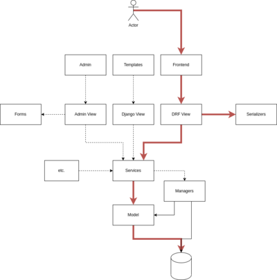

# REST API functionality to maintain a list of shipments

## Table of Contents
* [General Info](#general-information)
* [Technologies Used](#technologies-used)
* [Screenshots](#screenshots)
* [Project setup](#setup)
* [Usage](#usage)
* [Contact](#contact)
* [Test](#test)

## General Information
The business logic is completely separate from the view logic. Repositories in services are simple Python functions that are easy to test. We can call our services from any component, and we can also reuse some services in other projects. The ability to use different storage methods: ORM, cloud storage, file system etc, replace them and combine them.




## Technologies Used
* [Python](https://python.org) 3.8
* [PostgreSQL](https://www.postgresql.org) running with a _database_, _username_ and _password_
* [Docker](https://docs.docker.com/get-docker/)
* [Docker compose](https://github.com/docker/compose) for Postgersql
* [Django](https://www.djangoproject.com/download/) 4.0.4
* [VueJs](https://vuejs.org/guide/quick-start.html) 3
* [Bulma](https://bulma.io/documentation/overview/start/) css

## Screenshots


## App Structure


| Location                                  |  Content                                   |
|-------------------------------------------|--------------------------------------------|
| `/logistic_django_backend`                | Django Project & Backend Config            |
| `/logistic_django_backend/shippments_app` | Django App (`api/v1/`)                     |
| `/logistic_vue_ui`                        | Vue App .                                  |
| `/logistic_vue_ui/src/main.js`            | JS Application Entry Point                 |
| `docker-compose.yml`                      | Docker Compose Container configuration     |
| `backend_setup.sh`                        | Commands run on django container on start  |
| `requirements.txt`                        | Required Python packages. Installed by pip on image build |

## Prerequisites

Before getting started you should have the following installed and running:
- [X] Docker & Docker Compose

Docker should install everything else in their containers.

## Setup App
```
$ git clone https://github.com/MaksimShevtsov/django_vue_test_task.git
```
Setup
```
docker-compose up --build
```

## Enter shell of backend containers

```
$ docker exec -it container-name bash
```

## Schema

**Customer**
* customer_id: primary_key
* customer_name: CharField(max_length=50)
* customer_delivery_address: CharField(max_length=50)

**ShippingMethod**
* shipping_method_id: primary_key
* shipping_method_name: CharField(max_length=100)

**Order**
* order_id: primary_key
* shipping_date: DateField
* tracking_no: IntegerField(unique=True)
* status: BooleanField
* customer_id: ForeinKey(Customer)
* shipping_method_id: ForeinKey(ShippingMethod)

## API

**/shipping_methods**
* GET
* POST
```
{
"shipping_method_name": string,
}
``` 
* PUT
```
{
"shipping_method_id": int,
"shipping_method_name": string,
}
``` 

**/shipping_method/:id**
* DELETE

**/customers**
* GET
* POST
```
{
"customer_name": string,
"customer_delivery_address": string
}
``` 
* PUT
```
{
"customer_id: int,
"customer_name": string,
"customer_delivery_address": string
}
``` 
**/customer/:id**
* DELETE
```
{"customer_id": int}
```

**/orders**
* GET
* POST
```
{
"shipping_date": data,
"tracking_no": int,
"status":bool,
"customer_id": int,
"shipping_method_id": int
}
```
* PUT
```
{
"order_id": int,
"shipping_date": data,
"tracking_no": int,
"status":bool,
"customer_id": int,
"shipping_method_id": int
}
```

**/order/:id**
* DELETE
```
{"order_id": int}
```

## Test
```
python manage.py test
```
## Contact
Created by [@Max Shevtsov](https://www.linkedin.com/in/maksim-shevtsov/)
