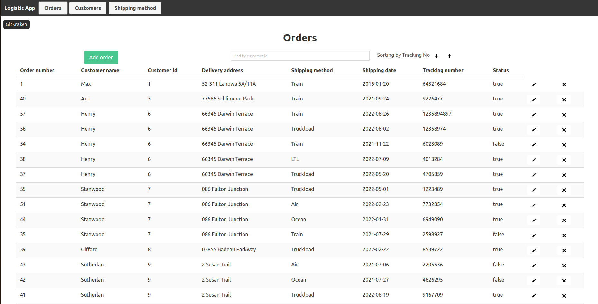

# REST API functionality to maintain a list of shipments

## Table of Contents
* [General Info](#general-information)
* [Technologies Used](#technologies-used)
* [Screenshots](#screenshots)
* [Project setup](#setup)
* [Usage](#usage)
* [Contact](#contact)
* [Test](#test)

## General Information


## Technologies Used
* [Python](https://python.org) 3.8
* [PostgreSQL](https://www.postgresql.org) running with a _database_, _username_ and _password_
* [Docker](https://docs.docker.com/get-docker/)
* [Docker compose](https://github.com/docker/compose) for Postgersql
* [Django](https://www.djangoproject.com/download/) 4.0.4
* [VueJs](https://vuejs.org/guide/quick-start.html) 3
* [Bulma](https://bulma.io/documentation/overview/start/) css

## Screenshots


## Setup
```
Creating virtual environments
pip install Django
pip install djangorestframework
install docker and docker compose
docker-compose -f docker-compose.dev.yaml up
pip install psycopg2
npm install -g @vue/cli
```

## Usage

### Compiles and hot-reloads for development
```
python3 manage.py runserver
docker-compose -f docker-compose.dev.yaml up
python3 manage.py makemigrations ShipmentsApp
python3 manage.py migrat ShipmentsApp
npm run serve
```
### Test
```
python manage.py test
```
## Contact
Created by [@Max Shevtsov](https://www.linkedin.com/in/maksim-shevtsov/)
